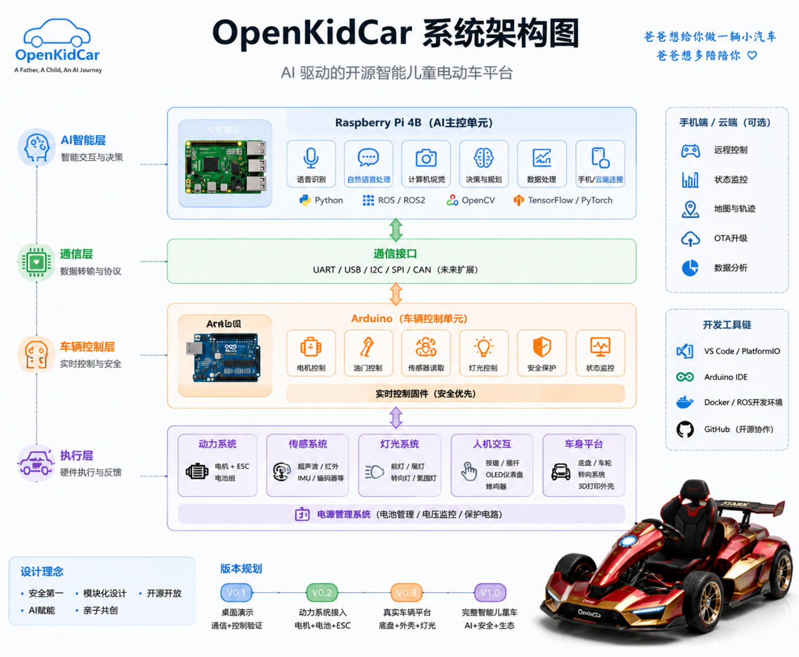

# 🚗 OpenKidCar

**🏎️ 干杯一号 Ganbei No.1 — AI 驱动的智能儿童卡丁车**

[](LICENSE) [](docs/product_requirements.md)

<p align="center">
  
</p>

## 爸爸想给你做一辆小汽车，爸爸想多陪陪你。

> 不是仅买一辆玩具车给你，而是成为你的榜样。

---

## 🌱 项目起源

我的儿子今年三岁。

这个年龄的孩子，会对各种各样的车感兴趣，公交车、卡车、摩托车、赛车、挖掘机、吊车、网约车……

大多数父母会选择购买一辆现成的儿童汽车。

但我想做一件不同的事情：

**亲手为他制造一辆车。**

这辆车不一定是世界上最快的，也不一定是最豪华的。

但它会拥有：

- 爸爸亲手设计的外观；
- 爸爸写的代码；
- 爸爸搭建的电子系统；
- 爸爸完成的创造过程。

我希望未来孩子长大以后，记住的不只是一辆车。

而是：

> 曾经爸爸尝试用自己的双手创造一些东西。

---

# 🚀 项目愿景

OpenKidCar 是一个基于 **AI + 开源硬件 + 嵌入式系统** 的智能儿童电动车开源项目。

目标不是简单制造一辆儿童玩具车，而是探索：

> 在 AI 时代，一个普通人是否可以借助 AI 完成过去需要专业团队才能完成的硬件创造？

OpenKidCar 希望打造一个：

- 开源的软件平台；
- 模块化的硬件架构；
- 可扩展的智能车系统；
- 普通家庭也可以参与的 Maker 项目。

---

# ✨ 项目特点

## 🤖 AI 驱动

利用 AI 辅助完成：

- 产品设计
- 软件开发
- 硬件学习
- 电路设计
- 三维建模
- 文档编写
- 问题调试

OpenKidCar 本身也是一次关于：

**AI 如何帮助普通人创造真实世界产品**

的实验。

---

## 🔧 模块化架构

OpenKidCar 采用类似真实汽车的分层设计：

```
                    AI智能层

              大脑

                    │

              通信接口

                    │

              车辆控制层


                    │

        ┌───────────┼───────────┐

        │           │           │

      电机        传感器       灯光

                    │

              电动车硬件平台
```

---

# 🏗️ 系统架构

## AI 控制单元（Raspberry Pi）

负责：

- AI交互
- 语音识别
- 摄像头视觉
- 数据处理
- 手机端连接
- 高级控制逻辑


## 车辆控制单元（Arduino）

负责：

- 油门控制
- 电机控制
- 灯光控制
- 传感器读取
- 安全保护
- 实时控制


## 硬件执行层

包括：

- 电池系统
- 电机系统
- 电机控制器
- 车架
- 传感器
- 自定义外壳

---

# 📌 当前阶段

## V0.1 桌面智能车控制 Demo

## V0.1 桌面智能车控制 Demo（AI 驾驶舱）

目标：

在没有真实车体的情况下，完成智能车辆核心系统验证。


计划实现：

✅ Raspberry Pi 与 Arduino 通信

✅ 自定义通信协议

✅ OLED仪表显示

✅ LED灯光控制

✅ 按键输入

✅ 油门模拟

✅ AI语音控制 Demo


当前状态：

🟡 开发中

演示效果：

孩子说“打开车灯”，AI 响应，Arduino 控制 LED 亮起。

---

# 🛣️ Roadmap

## V0.1：智能车电子控制原型

目标：

验证软件与电子架构。


---

## V0.2：动力系统接入

目标：

加入：

- 电机
- 电机控制器
- 电池系统
- 速度控制


---

## V0.3：真实车辆平台

目标：

完成：

- 儿童电动车底盘改造
- 自定义车身设计
- 仪表系统
- 灯光系统


---

## V1.0：OpenKidCar 智能儿童车

目标：

实现：

- AI语音助手
- 家长控制
- 手机 App
- 自动安全保护
- 3D打印外观
- 完整开源资料


---

# 📂 项目目录

```text
OpenKidCar/
├── README.md
├── LICENSE
├── .github/               # 社区文档 + Issue / PR 模板
│   ├── CONTRIBUTING.md
│   ├── CODE_OF_CONDUCT.md
│   └── SECURITY.md
├── docs/                  # 产品需求、架构、协议、路线图
│   ├── product_requirements.md
│   ├── roadmap.md
│   ├── architecture.md
│   ├── hardware_io_map.md       # 引脚分配图（接口契约）
│   ├── communication_protocol.md
│   ├── hardware_bom.md
│   ├── development_notes.md     # 开发笔记与状态存档
│   └── development_log.md
├── hardware/
│   ├── bom/               # BOM 清单
│   ├── circuit/           # 电路设计
│   └── pcb/               # PCB 设计
├── firmware/
│   └── arduino/           # Arduino 固件
├── software/
│   └── raspberry_pi/      # Raspberry Pi 软件
├── cad/
│   └── body_design/       # 车身三维模型
├── media/
│   ├── images/            # 图片与视频素材
│   ├── prototype/         # 原型照片与视频
│   └── videos/            # 项目视频
└── logs/
    └── 开发日记/           # 开发过程记录
```

# 🚀 快速开始

项目正处于 V0.1 原型开发阶段。可以先阅读 [产品需求文档](docs/product_requirements.md) 了解干杯一号的完整功能规划，或从 [系统架构](docs/architecture.md)、[通信协议](docs/communication_protocol.md) 和 [开发日志](docs/development_log.md) 开始了解技术细节。

想要参与共同开发？请先阅读 [贡献指南](.github/CONTRIBUTING.md) 与 [行为准则](.github/CODE_OF_CONDUCT.md)。

---

# 🧩 硬件计划

当前实验平台：

| 硬件 | 用途 |
|---|---|
| Raspberry Pi | AI主控 |
| Arduino | 车辆控制器 |
| OLED显示屏 | 仪表盘 |
| LED灯 | 状态显示 |
| 按钮 | 人机输入 |
| 传感器 | 环境感知 |
| 电机系统 | 后续接入 |

---

# 📖 开发日志

这个项目会记录完整过程。

包括：

- 从零学习电子控制；
- 第一次让 Raspberry Pi 和 Arduino 通信；
- 第一次控制电机；
- 第一次设计车身；
- 第一次让孩子驾驶自己制造的汽车。


开发过程本身，也是项目的一部分。

---

# 🤝 欢迎参与

OpenKidCar 欢迎所有人的参与。

无论你擅长：

- AI开发
- Python
- Arduino
- 嵌入式
- 电路设计
- 机械设计
- 3D建模
- 产品设计

都可以参与。

贡献前请阅读 [贡献指南](.github/CONTRIBUTING.md) 与 [行为准则](.github/CODE_OF_CONDUCT.md)。如发现安全问题，请通过 [SECURITY.md](.github/SECURITY.md) 中说明的方式私密反馈。


你不需要是专家。

因为这个项目本身，就是探索：

**普通人如何借助 AI 学习并创造。**

---

# ❤️ 致我的孩子

也许多年以后，

你不会记得这辆车。

但我希望你记得：

你的爸爸曾经努力尝试创造一个属于你们的作品。

这个世界不仅可以被购买。

也可以被创造。

---

# 📜 License

本项目采用 [MIT License](LICENSE)，属于宽松型开源许可证：允许自由使用、修改与分发，包括商业用途，但需保留版权声明。